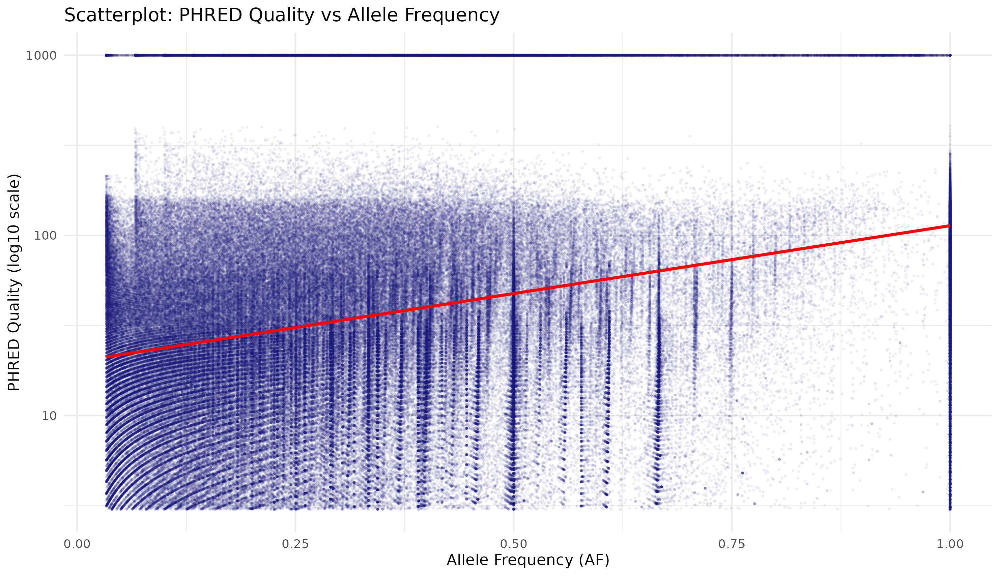

# Unix Course Final Assignment
**Author:** Petr Varga (user05)

Put your shell code in `workflow.sh` and the R code to visualise results in `data-analysis.R`.

## Pipeline steps
1. Filtered VCF for chromosomes 1 and Z.
2. Extracted QUAL (col 6) and AF1 (from INFO field) using `awk`.
3. Visualized the correlation in R using `ggplot2` with log10 scale.

## Shell Code (`workflow.sh`)
```bash
zcat /data-shared/vcf_examples/luscinia_vars.vcf.gz | grep -v '^#' | awk 'BEGIN {OFS="\t"} {
    start = index($8, "AF1=");
    if (start > 0) {
        sub_str = substr($8, start + 4);
        split(sub_str, a, ";");
        af = a[1];
        print $6, af
    }
}' > data/qual_af.tsv
```

## What is in the graph?
The scatterplot shows a positive correlation between Allele Frequency and PHRED Quality.
- **Common variants** (AF close to 1.0) tend to have higher quality scores, as they are more frequently observed and verified.
- **Rare variants** (AF near 0) exhibit a wider range of quality, including many low-quality calls that may represent sequencing artifacts.
- A significant number of variants reached the maximum quality score (999), forming a solid line at the top of the plot.


